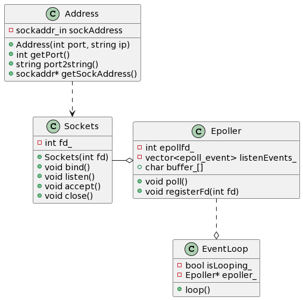
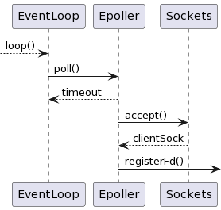

# Notes for Version 1.1
An improved EchoServer with based-object programming
1. using epoll I/O multiplexing
2. using class to manager resources
一个使用 I/O 复用及基于对象特性的 Echo 服务器

- [Notes for Version 1.1](#notes-for-version-11)
- [Improvements](#improvements)
- [Others](#others)
- [Reference](#reference)

# Improvements
使用地址和套接字两个类，分别管理地址资源和套接字资源
```c++
// src/Address.h
class Address
{
public:
    Address(int port = 0, std::string ip = "127.0.0.1");

    const int getPort() const;
    const std::string port2string() const;
    socklen_t* addrLen() { return (socklen_t*)&addrLen_; }  // 用于接受连接

    struct sockaddr* getSockAddress() const 
    { return (struct sockaddr*)&sockAddress_; } // 转换地址类型

private:
    uint32_t addrLen_;
    struct sockaddr_in sockAddress_;
};

// src/Sockets.h
class Sockets
{
public:
    explicit Sockets();
    ~Sockets();

    int fd() const { return fd_; }

    void bind(const Address& localAddress);
    void listen();

    int accept(Address *peerAddress);

    void close();
private:
    int fd_;
};
```
使用 `Epoller` 管理 `epoll` 资源以及处理服务器逻辑
```c++
class Epoller
{
public:
    Epoller();
    Epoller(const Sockets&socket);
    ~Epoller();
    void poll(int timeout);
    void registerFd(int fd);

    void clearBuf();
private:
    const static int MaxEventNumber = 1024;
    const static int BufferSize = 4096;

    char buffer_[BufferSize];
    Sockets serverSock_;
    int epollFd_;
    std::vector<epoll_event> listenEvents_;
};
```
使用 `EventLoop` 管理事件循环
```c++
class EventLoop
{
public:
    EventLoop(Epoller* epoller);
    
    void loop();
private:
    bool isLooping_;
    Epoller* epoller_;
};
```
以上几个类的关系如下:

当服务器接受新连接的时候，调用关系如下：

1. 进入事件循环，程序阻塞在 `Epoller` 的 `poll()` 上 ( `poll` 是 `epoll_wait()` 的封装)
2. 当有新连接进入时，`Epoller` 调用成员 `Sockets` 的 `accept()` 函数接受新连接，返回新连接的套接字 `clientSock` 
3. `Epoller` 调用 `registerFd()` 将 `clientSock` 纳入 `Epoller` 监听中

还需要考虑初始化的问题，即初始服务器的套接字如何纳入 `Epoller` 进行监听

这里使用的方法是:
 `Epoller` 拥有一个 `Sockets` 类，成员 `Sockets` 管理服务器文件描述符
当 `Epoller` 实例初始化的时候，调用 `registerFd()` 直接将服务器的文件描述符注册监听

最后是 `EchoServer` 服务器主程序
```c++
// src/EchoServer.cpp
int main()
{
    int port = 9190;
    Address server_address(port);
    Sockets sock;
    sock.bind(server_address);
    sock.listen();
    
    Epoller epoller(sock);
    EventLoop loop(&epoller);
    loop.loop();
}
```
以上还可以将 `Sockets` 的行为进一步封装至 `Epller` 中
但实际上，业务逻辑隐藏在了 `EventLoop` 的 `loop()` 和 `Epoller` 的 `poll()` 形成的大循环中，不利于功能的扩展<sup>[2]</sup>
而且对于该版本的 `EchoSever` 只能服务一个 `client` ，断开后才能服务下一个 `client`
因此下一步将尝试将业务逻辑分离

# Others
现在有了多个头文件和源文件，直接使用 `g++` 编译十分麻烦，这里使用 `cmake`
> `cmake` 基础见 [路径](../../MyNotes/Tool/CMake.md)

新建文件夹 `src` ，将所有头文件和源文件都放入 `src` 文件夹中
在工程目录和 `src` 目录中都中新建文件 `CMakeLists.txt` ，此时目录树为
```
|-- v1.1
|   |-- CMakeLists.txt
|   /-- src
|       |-- EchoServer.cpp
|       |-- Address.cpp
|       |-- Address.h
|       |-- ...
|       |-- CMakeLists.txt
```
在工程目录的 `CMakeLists.txt` 内容如下：
```bash
# cmake 版本支持
cmake_minimum_required(VERSION 3.10) 

# 项目名
PROJECT(ECHOSERVER CXX)

# specify the C++ standard 
set(CMAKE_CXX_STANDARD 11) 
set(CMAKE_CXX_STANDARD_REQUIRED True) 

# 将 src 和 bin 都设置为项目子目录
add_subdirectory(src bin)
```
在 `src` 中的 `CMakeLists.txt` 内容如下：
```bash
# 显示指定变量 SRC_LIST
# 将需要编译的文件名都幅值至变量 SRC_LIST 中
set(SRC_LIST
    Address.cpp Address.h
    EchoServer.cpp
    Sockets.cpp Sockets.h
    EventLoop.cpp EventLoop.h
    Epoller.cpp Epoller.h
    )

# 根据 SRC_LIST 的文件构建目标文件 EchoServer
add_executable(EchoServer ${SRC_LIST}) 
```
采用外部构建，编写脚本 `compile.sh`
```bash
# !bin/bash
set -x  # 显示命令
SOURCE_DIR=`pwd` # 令变量 SOURCE_DIR 的值为 当前文件夹
BUILD_DIR=${BUILD_DIR:-build}   # 令变量 BUILD_DIR 的值为 build 文件夹

mkdir -p $BUILD_DIR \   # 新建 build 文件夹
       	&& cd $BUILD_DIR \  # 进入 build 文件夹
	&& cmake $SOURCE_DIR \  # cmake 外部构建
	&& make $*  # 构建目标文件
```
再编写方便运行目标文件的脚本
```bash
# !bash/bin
./build/bin/EchoServer
```

# Reference
- [1] 游双. Linux高性能服务器编程. 2013-06
- [2] 陈硕. Linux多线程服务端编程——使用muduo C++网络库. 2013-01