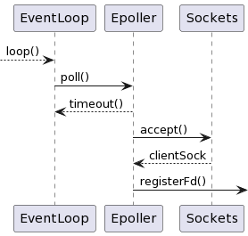
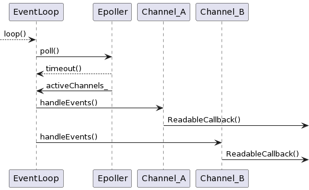

# Notes for Version 1.2
An improved EchoServer with based-object programming
1. using epoll I/O multiplexing
2. using class to manager resources
3. based on a basic Reactor
一个使用 I/O 复用及基于对象特性的具有 Reactor 范式雏形的 Echo 服务器

- [Notes for Version 1.2](#notes-for-version-12)
- [Improvements](#improvements)
- [function wrapper - function (函数包装器)](#function-wrapper---function-函数包装器)
  - [函数包装器基本用法](#函数包装器基本用法)
- [Others](#others)
- [Reference](#reference)

# Improvements
引入类 `Channel` 处理文件描述符的监听事件和对应的回调函数
那么需要考虑以下问题：
Channel
1. 管理文件描述符对应的回调函数
    - 服务器的文件描述符回调函数为 接受连接
    - `client` 的描述符回调函数为 回射消息
2. 接受连接时，会生成对应的文件描述符 `fd` ，需要根据该 `fd` 构造 `Channel`
    - 构造 `Channel` 后注册对应的回调函数
    - 将文件描述符加入到 `epollfd` 的监听中
3. 断开连接时也要有对应的回调函数，然后析构对应的 `channel`
4. 负责执行回调函数
5. 什么时候创建？哪个类管理？

在该版本中，仅粗略实现了 1、2、4、5，并没有实现 3
```c++
class Channel
{
public:
    using ReadCallback = std::function<void()>;
    using CloseCallback = std::function<void()>;
    // using ConnectionCallback = std::function<void()>;

    Channel() = default;
    Channel(int fd);
    
    int fd() { return fd_; }
    void setReadCallback(const ReadCallback& cb) { readCallback_ = cb; }    // 可读事件的回调函数 
    void setCloseCallback(const CloseCallback& cb) { closeCallback_ = cb; } // 断开连接的回调函数 not used yet

    void setRevents(uint32_t events) { revents_ = events; }
    void handleEvents(); // execute callbacks
private:    
    const static int ReadEvent;
    const static int NoEvent;

    ReadCallback readCallback_; // 可读回调函数
    CloseCallback closeCallback_;   // 连接关闭时的回调函数，not used yet

    int revents_;   // epoll_wait 返回的事件
    int events_;    // 监听的事件
    int fd_;
};
```
文件描述符是在连接建立阶段创建的，`Socket` 调用 `accept()` 生成客户端描述符，而 `serverSock_` 又由 `Epoller` 管理，因此 `Epoller` 负责创建 `Channel` 及管理其生存期，该版本使用 `std::map<int, Channel>` 数据结构来负责查找 `fd` 对应的`Channel`
当建立连接时，根据分配的文件描述符创建 `Channel`，设置其回调函数并将其插入 `map<int, Channel>` 中
```c++
void Epoller::acceptConnection()    // 建立连接时的回调函数
{
    Address clientAddres;   // 对端地址
    int clientSock = serverSock_.accept(&clientAddres); // 接受连接，分配文件描述符
    printf("Accept fd %d\n", clientSock);
    registerFd(clientSock, [this, clientSock]{ onMessage(clientSock); });   // 调用 registerFd 纳入监听并设置回调函数
}

void Epoller::registerFd(int fd, ReadCallback callback)
{
    printf("Register fd %d\n", fd);
    epoll_event event;
    event.data.fd = fd;
    event.events = EPOLLIN;
    ::epoll_ctl(epollFd_, EPOLL_CTL_ADD, fd, &event);
    Channel channel(fd);    // 根据文件描述符创建 Channel
    channel.setReadCallback(callback); // 设置回调函数
    channelsMap.insert(std::make_pair(channel.fd(), channel)); // 插入channelMap进行管理
}
```
此外，`Channel` 还要负责执行事件的回调函数
```c++
void Channel::handleEvents()
{
    // not worked yet
    if ( !(revents_ & EPOLLIN))
    {
        printf("Excute closeCallback\n");
        if (closeCallback_)
        {
            closeCallback_();
        }
    }

    // work
    if (revents_ & EPOLLIN)
    {
        printf("Excute readCallback\n");
        if (readCallback_)
        {
            readCallback_();
        }
    }
}
```
那么此时，建立连接的时序图为：

而当事件可读时的时序图为：

(1) 当事件可读的时，`Epoller` 将激活的 `Channel` 填入 `EventLoop` 管理的 `activeChannels_` 中
(2) 调用 `Channel` 的 `handleEvents()` 执行回调函数 `ReadableCallback()` （只考虑回射业务逻辑）

# function wrapper - function (函数包装器)
`Channel` 负责指定文件描述符对应的回调函数，需要了解回调函数
## 函数包装器基本用法
头文件 `<functional>`，`std::function` 可以对任何可以调用的目标实体进行存储、复制和调用操作，是**函数的容器**
```c++
#include <functional>
int main()
{
    int a = 10;
    std::function<int(int)> func = [&](int value)->int {
        return 1 + value + a;
    };   // 包装一个返回值为 int，参数为 (int) 的函数
    func(10);   // 调用函数
}
```
`std::bind` 则用来绑定函数调用函数，能够提前将一部分参数提前绑定到函数上，在参数齐全后完成调用
```c++
int foo(int a, int b, int c)
{ }

int main()
{
    auto bindFoo = std::(foo, std::placeholders::_1, 1, 2); // 提前绑定参数 b, c，并使用 std::placeholders::_1 占用参数 a 的位置
    bindFoo(1); // 将传入参数替代占用符 std::placeholders::_1 完成调用
}
```
 `std::function` 以及 `std::bind` 结合使用的几个例子(示例来自cppreference<sup>[3]</sup>)
```c++
class Foo
{
    Foo(int num) : num_(num) {}
    void print_add(int i) const { std::cout << num_+i << '\n'; }
    int num_;
};

void print_num(int i)
{
    std::cout << i << '\n';
}

int main()
{
    std::function<void(int)> f_display = print_num;
    f_display(-9);  // -9
 
    std::function<void()> f_display_42 = []() { print_num(42); };
    f_display_42(); // 42
 
    std::function<void()> f_display_31337 = std::bind(print_num, 31337);
    f_display_31337();  // 31337
 
    // 绑定类的成员函数
    std::function<void(const Foo&, int)> f_add_display = &Foo::print_add;
    const Foo foo(314159);  
    f_add_display(foo, 1);  // 314160
    f_add_display(314159, 1);   // 314160   发生了隐式转换构造
    // Notes:
    // 对于绑定类成员函数的包装器，其模板(返回)类型必须显式指定
    // auto f_add_display = &Foo::print_add // 无法编译

    // Notes: 
    // std::placeholders 的占位符 对应包装器的参数位置
    // void print(int a, float b, char c)
    // eg. auto f = std::bind(print, _2, _3, _1)
    // f('a', 10, 1.45)

    // 绑定类成员函数:
    // 类的成员函数需要通过类或者指针调用，类成员函数都会隐含参数 this，因此需要传入该参数
    // bind(&Foo::func, foo, ...)
    // 其中 foo 代表传入 this 指针，使用 &foo 或 foo 都可行
    // 有一说 bind 绑定对应时会拷贝对象，如果存在指针拷贝会发生浅拷贝，引起 double free 而崩溃，测试代码见后

    using std::placeholders::_1;
    std::function<void(int)> f_add_display2 = std::bind( &Foo::print_add, foo, _1 );
    f_add_display2(2);  // 314161
 
    std::function<void(int)> f_add_display3 = std::bind( &Foo::print_add, &foo, _1 );
    f_add_display3(3);  // 314162

    // 递归调用
    auto factorial = [](int n) {
        // 存储 lambda 对象模拟“递归 lambda ”，有额外开销
        std::function<int(int)> fac = [&](int n){ return (n < 2) ? 1 : n*fac(n-1); };
        // note that "auto fac = [&](int n){...};" does not work in recursive calls
        return fac(n);
    };
    for (int i{5}; i != 8; ++i) { std::cout << i << "! = " << factorial(i) << ";  "; }
    // 5! = 120;  6! = 720;  7! = 5040;
}
```
`std::bind` 默认拷贝，使用 `std::ref` 代表传引用
```c++
void print(int a, int b)
{
    std::cout << a << " " << b << end;
    ++a;
    ++b;
}
int a = 1;
int b = 2;
auto func = std::bind(print, a, std::ref(b));
std::cout << a << " " << b << end;  // 1 3
```
如果类中有指针，`std::bind` 会出现浅拷贝，对象生命期结束可能会引起 `doulbe free` ，因此需要保证回调前指针是有效的
> 如果绑定按值绑定，会调用类的拷贝构造函数
```c++
class Foo
{
public:
    Foo(int x):num_(new int(x))
    {
        cout << "构造函数调用\n";
    };

    ~Foo()
    {
        cout << "析构调用\n";
        delete num_;
        num_ = nullptr;
    }

    // 如果不写拷贝构造函数，将会调用默认合成拷贝构造函数，发生浅拷贝，可能出现 double free
    Foo(const Foo& f)
    {
        cout << "拷贝调用\n";
        this->num_ = new int(*f.num_);
    }

    void print(int x) const
    {
        cout << __FUNCTION__ << "Foo: " << x << "\n";
    }
private:
    int* num_;
};


int main()
{
    {
        Foo f3(4);
        auto func5 = bind(&Foo::print, f3, 6);
        func5();
    }
    cout << "end2\n";
    cout << "************************************\n";
    Foo f4(6);
    {
        auto func5 = bind(&Foo::print, f4, 7);
    }
    cout << "end3\n";
}
```
上述代码运行结果为:
```bash
构造函数调用
拷贝调用
printFoo: 6
析构调用
析构调用
end2
************************************
构造函数调用
拷贝调用
析构调用
end3
析构调用
析构调用
```
而如果将拷贝构造函数注释掉，则无法运行到 `end2` 的位置，其运行结果为：
```bash
构造函数调用
printFoo: 6
析构调用
析构调用
free(): double free detected in tcache 2
Aborted
```
具体测试代码见 `v1.2/test.cpp`
# Others
`__FILE__` 宏代表当前源码文件的文件名 
`__LINE__` 宏代表当前文件名和代码所在的行数
`__FUNCTION__` 宏代表当前调用的函数名

# Reference
- [1] 游双. Linux高性能服务器编程. 2013-06
- [2] 陈硕. Linux多线程服务端编程——使用muduo C++网络库. 2013-01
- [3] [cpppreference](https://zh.cppreference.com/w/cpp/utility/functional/function)
- [4] [Modern Cpp turorial](https://github.com/changkun/modern-cpp-tutorial)