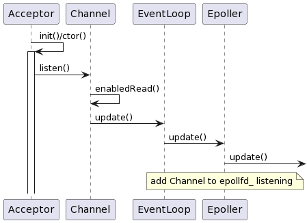
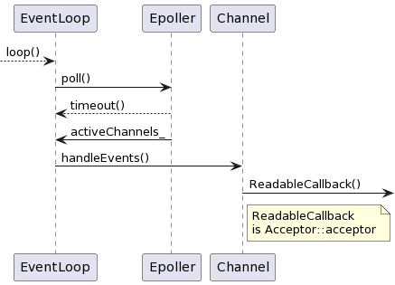

# Notes for Version 1.3
A daytime Server with based-object programming
1. using epoll I/O multiplexing
2. using class to manager resources
3. based on a basic Reactor
一个使用 I/O 复用及基于对象特性的具有 Reactor 的 daytime 服务器

- [Notes for Version 1.3](#notes-for-version-13)
- [Improvements](#improvements)
  - [Sockets 的修改](#sockets-的修改)
  - [其他主要修改](#其他主要修改)
  - [测试](#测试)
- [Others](#others)
  - [CMake 构建多目录项目](#cmake-构建多目录项目)
- [Reference](#reference)

# Improvements
Ver1.2 使用了 `Channel` 管理文件描述符管理回调函数及文件描述符，是一个粗糙的单线程 Reactor

`Sockets` 、`Epoller` 都暴露给了用户，还需要额外手动调用 `bind()`、`listen()` 等函数

此外，业务逻辑应该由用户代码提供，而非集成在网络 `I/O` 相关的代码中

该版本将参照[1]的设计，进一步将以上明显的问题解决

## Sockets 的修改
为了提高 Debug 效率，增加 `Sockets` 的成员函数 `setResuseAddr()` ，使其强制使用处于 `TIME_WAIT` 状态的 `socket` 地址<sup>[2]</sup>
```c++
void Sockets::setReuseAddr()
{
    int val = 1;
    int ret = setsockopt(fd_, SOL_SOCKET, SO_REUSEADDR, &val, sizeof(val));
    assert(ret != -1);
}
```
> REUSEPORT 和 REUSEADDR 的区别（概括）<sup>[3-4]</sup>:
> 1. `SO_REUSEADDR` 允许将 `TIME_WAIT` 状态的 `IP+PORT` 重用；允许在绑定地址全局 `IP` 地址（0.0.0.0）的基础上再绑定非全零的 `IP` 地址；
> 2. `SO_REUSEPORT` 允许不同进程绑定到同一个 `IP+PORT` 上 ，而不报错

> `SO_REUSEADDR` 通知内核，如果端口忙，但TCP状态位于 `TIME_WAIT` ，可以重用端口。这个一般用于当你的程序停止后想立即重启的时候，如果没有设定这个选项，会报错`EADDRINUSE`，需要等到 `TIME_WAIT` 结束才能重新绑定到同一个 `ip+port` 上。
> `SO_REUSEPORT` 用于多核环境下，允许多个线程或者进程绑定和监听同一个 `ip+port` ，无论 `UDP、TCP`（以及 `TCP` 是什么状态）

## 其他主要修改
`EventLoop` 使用智能指针 `unique_ptr` 管理 `Epoller` ，不再持有裸指针

为了为将来的 `one loop per thread` 的多线程编程做铺垫，将 `isLooping_` 修改为 `atomic_bool` 类型，增加线程 `ID` 成员

Ver1.2 中，服务端监听描述符初始化、建立连接的逻辑都放在了 `Epollor` 中，现在将其分离，具体来说这些功能由新增加的 `Acceptor` 类负责。 `Epoller` 也不再负责回调函数的注册

`Acceptor` 类负责服务器监听描述符的初始化以及建立连接

由于 `Acceptor` 要负责管理服务器的监听描述符，因此将拥有服务器的 `socket` 地址，具体来说它会拥有 `Sockets` 、 `Channel` 以及 `NewConnectionCallback`

`Sockets` 是 `socket` 的封装类，管理服务器的 `socket` 地址；`Channel` 负责服务器文件描述符事件的注册、回调函数的执行；`NewConnectionCallback` 代表建立连接时执行的回调函数

```c++
class Acceptor
{
public:
    using NewConnectionCallback = std::function<void(int, const Address&)>;

    Acceptor(EventLoop* loop, const Address& localAddress);

    void listen();
    void setNewConnectionCallback(NewConnectionCallback cb) { newConnectionCallback_ = std::move(cb); }
private:
    void accept();
    std::atomic_bool listenning_;

    EventLoop* loop_;
    Sockets acceptSocket_;
    Channel acceptChannel_;
    NewConnectionCallback newConnectionCallback_;
};
```
又 `Channel` 处理事件的逻辑在 `EventLoop` 中，因此 `Channel` 需要能被传递给由 `EventLoop` 管理的 `Epoller` 中
```c++
void EventLoop::loop()
{
    assert(!isLooping_);
    isLooping_.exchange(true);
    while (!quit_)
    {
        // ...
        for (auto activeChannel: activeChannels_)
        {
            activeChannel->handleEvents();  // Channel 处理事件
        }
    }
    isLooping_.exchange(false);
}
```
思路如下：
1. `Acceptor` 初始化，绑定 `socket` 地址、设置 `Acceptor` 中 `Channel` 的回调函数 `Acceptor::accept()`，然后调用 `listen()` 开始监听
2. 调用 `listen()` 时，会调用 `Channel` 的 `enabledReadable()` ，将服务端文件描述符的可读事件加入监听
3. `enabledReadable()` 调用 `Channel::update()` 以更新监听事件
4. 由于 `Epoller` 由 `EventLoop` 持有并管理生存期，因此 `Channel` 增加成员 `EventLoop*` ，`Channel::update()` 调用 `EventLoop::updateChannel()` 
5. `EventLoop::updateChannel()` 再调用它持有的 `Epoller` 的 `updateChannel()`，将事件加入 `epollfd_` 的监听

服务器初始化时序图如下:


实现中较为关键的一点是 `Epoller::updateChannel()` 中， `::epoll_ctl()` 使用的 `epoll_event` 的 `data` 成员使用的不是 `fd` ，而是 `ptr` 。该 `ptr` 是 `void*`，可以指向任意对象，因此可以传递 `Channel*` 进去，要使用的时候，将其再转换为 `Channel*` 即可。那么 `Epoller::poll()` 将修改为：

```c++
void Epoller::poll(int timeoutMill, std::vector<Channel*>& acitiveChannels)
{
    int activeEventsNum = ::epoll_wait(epollfd_, 
                                        activeEvents_.data(), 
                                        static_cast<int>(activeEvents_.size()), 
                                        timeoutMill);
    for (int i = 0; i < activeEventsNum; ++i)
    {
        // 将 ptr 转换为 Channel* 
        Channel* channel = static_cast<Channel*>(activeEvents_[i].data.ptr);

        // 设置 channel 的返回事件
        channel->setReturnEvents(activeEvents_[i].events);
        // 加入活跃 Channel 列表中
        acitiveChannels.push_back(channel);
    }
}
```

`Channel` 主要在于完善：
1. 如上述步骤(3)可知，增加成员 `EventLoop*`
2. 增加了几个回调函数 `enabled*()` 作为成员
3. 增加 `update()` 函数
4. 增加 `bool polling_` 成员，用于调用 `Epoller::updateChannel()` 时对修改文件描述符的操作进行判断

那么根据以上修改，当有新连接建立时，函数调用的时序过程如下：


## 测试
测试代码如下，实现了较为简单的 `daytime` 服务器（发送完当前事件后，服务端主动断开连接），例子来源为：[1]P303 的测试及练习1、2
```c++
void newConnection(int sockfd, const Address& peerAddrsss)
{
    printf("NewConnection: accept a new connection from port[%d]\n", peerAddrsss.getPort());
    time_t t;
    time(&t);
    char* str = ctime(&t);
    char buf[64];
    bzero(buf, sizeof(buf));
    ::strcat(buf, str);
    ::write(sockfd, buf, sizeof(buf));
    ::close(sockfd);
}

int main()
{
    int port1 = 9190;
    Address server_address1(port1);
    EventLoop loop;
    Acceptor acceptor1(&loop, server_address1);
    acceptor1.setNewConnectionCallback(newConnection);
    acceptor1.listen();

    int port2 = 9192;
    Address server_address2(port2);
    Acceptor acceptor2(&loop, server_address2);
    acceptor2.setNewConnectionCallback(newConnection);
    acceptor2.listen();
    
    loop.loop();
}
```

以下为分别两次连接的服务端运行结果：
```bash
listen...
EventLoop updateChannel...
Epoller updateChannel...
Update EPOLL_CTL_ADD...
listen...
EventLoop updateChannel...
Epoller updateChannel...
Update EPOLL_CTL_ADD...
Epoller is polling...
accept...
client fd: 6
Run newConnectionCallback
NewConnection: accept a new connection from port[36210]
Epoller is polling...
accept...
client fd: 6
Run newConnectionCallback
NewConnection: accept a new connection from port[36216]
Epoller is polling...
accept...
client fd: 6
Run newConnectionCallback
NewConnection: accept a new connection from port[39474]
Epoller is polling...
accept...
client fd: 6
Run newConnectionCallback
NewConnection: accept a new connection from port[36220]
Epoller is polling...
accept...
```

以下为两次连接的客户端运行结果：
```bash
name:~$ nc 127.0.0.1 9190
Mon Jun 13 12:24:56 2022

name:~$ nc 127.0.0.1 9192
Mon Jun 13 12:24:57 2022

name:~$ nc 127.0.0.1 9190
Mon Jun 13 12:25:02 2022

name:~$ nc 127.0.0.1 9192
Mon Jun 13 12:25:03 2022
```

# Others
## CMake 构建多目录项目


# Reference
- [1] 陈硕. Linux多线程服务端编程——使用muduo C++网络库. 2013-01
- [2] 游双. Linux高性能服务器编程. 2013-06
- [3] [How do SO_REUSEADDR and SO_REUSEPORT differ?](https://stackoverflow.com/questions/14388706/how-do-so-reuseaddr-and-so-reuseport-differ)
- [4] [SO_REUSEPORT和SO_REUSEADDR特性](https://zhuanlan.zhihu.com/p/501695927)